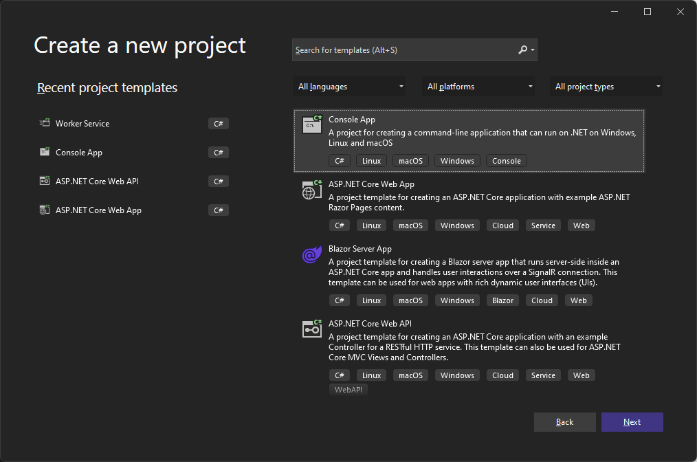
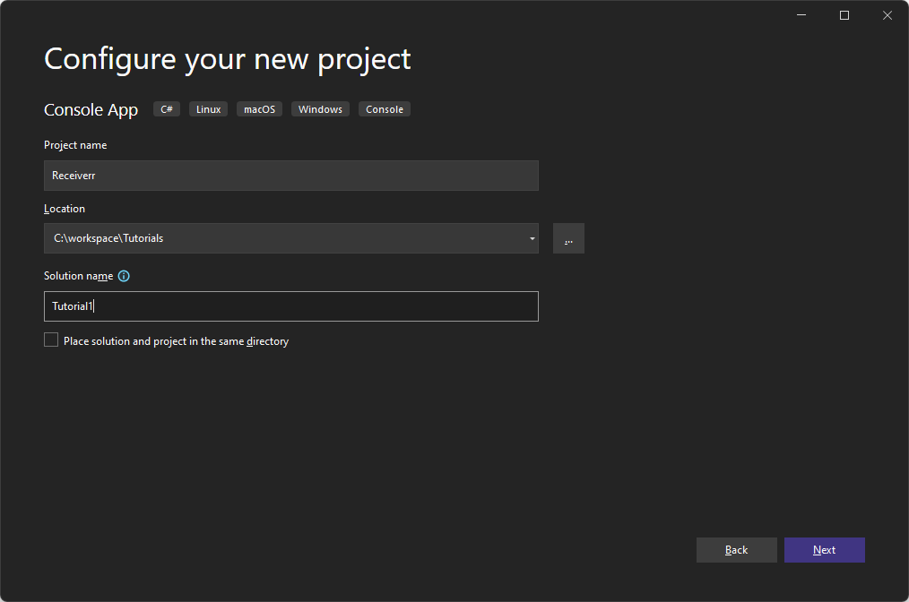
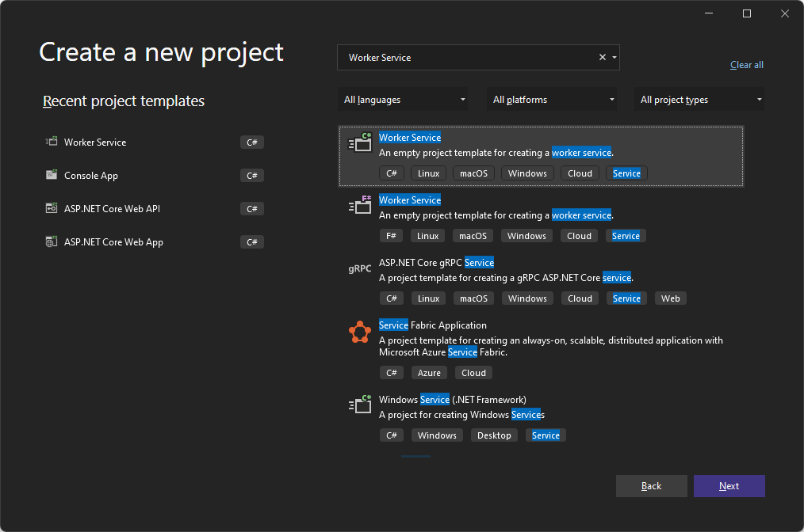
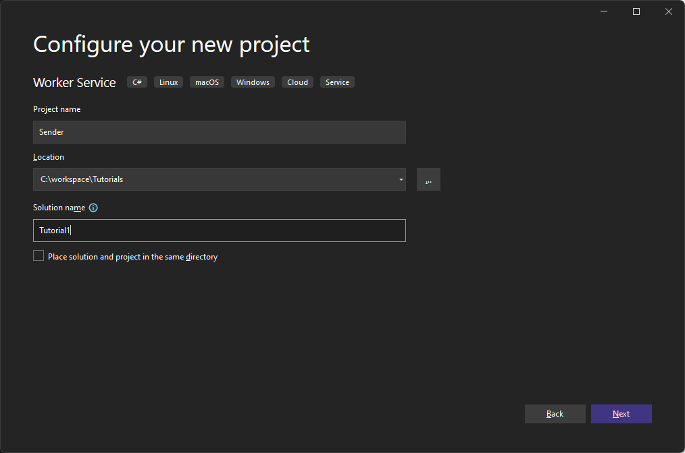
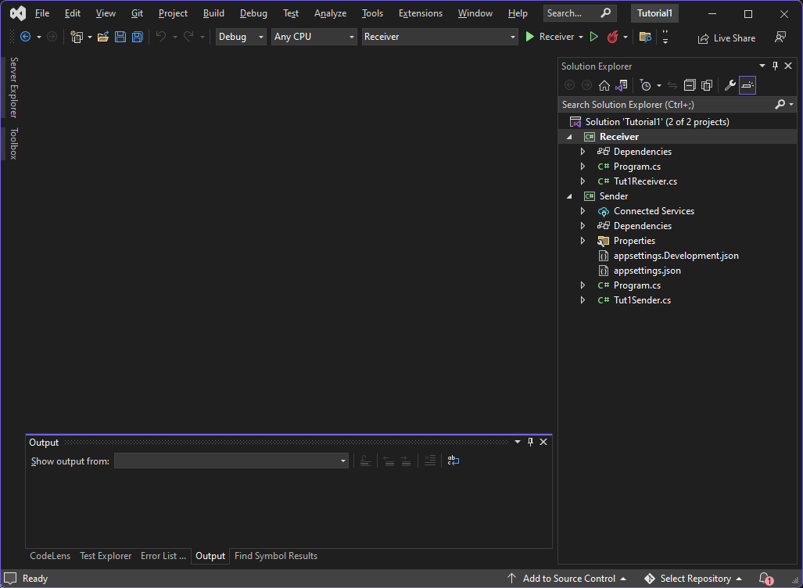

# RabbitMQ Tutorial - "Hello World!"

## Introduction

> #### Prerequisites
> This tutorial assumes RabbitMQ is [downloaded](https://www.rabbitmq.com/download.html) and installed and running 
> on `localhost` on the [standard port](https://www.rabbitmq.com/networking.html#ports) (`5672`). 
> 
> In case you use a different host, port or credentials, connections settings would require adjusting.
>
> #### Where to get help
> If you're having trouble going through this tutorial you can contact us through Github issues on our
> [Steeltoe Samples Repository](https://github.com/SteeltoeOSS/Samples).


RabbitMQ is a message **broker**; it accepts and forwards messages.

You can think of it as a post office; when you put the mail that you want sent in a post office box,
you can be sure that the letter carrier will eventually deliver the mail to your recipient.

In this analogy, RabbitMQ is a post office box, a post office, and a letter carrier.

The major difference between RabbitMQ and the post office is that it doesn't deal with paper,
instead it accepts, stores, and forwards binary blobs of data ‒ **messages**.

RabbitMQ, and messaging in general, use some jargon as follows:

 - **Producing** means nothing more than sending a message. A program that sends messages is a **producer**. In these tutorials we use the symbol below to represent a **producer**.
  <p>
  
</p>

 - **A queue** is the name for the post office box in RabbitMQ. Although messages flow through RabbitMQ and your applications, they can only be stored inside a **queue**.
    A **queue** is only bound by the host's memory &amp; disk limits, it's essentially a large message buffer.
    Many **producers** can send messages that go to one queue, and many **consumers** can try to receive data from a single **queue**.  We use the symbol below to represent a **queue**.

 <p>
  
</p>

 - **Consuming** has a similar meaning to receiving a message. A **consumer** is a program that mostly waits to receive messages.  We use the symbol below to represent a **consumer**
<p>
  
</p>

Note that the **producer**, **consumer**, and **broker** do not have to reside on the same host; indeed in most applications they don't.
An application can be both a **producer** and **consumer**, at the same time.

## "Hello World" (using Steeltoe)

In this part of the tutorial we'll write two programs using the Steeltoe Messaging framework;
a **producer** that sends a single message, and a **consumer** that receives
messages and prints them out.  We'll gloss over some of the details in
the Steeltoe API, concentrating on this very simple thing just to get
started.  It's a "Hello World" of messaging.

In the diagram below, "P" is our **producer** and "C" is our **consumer**. The
box in the middle is a queue - a message buffer that RabbitMQ keeps
on behalf of the **consumer**.

<p>
  
</p>

 ### The Steeltoe Messaging Framework

 RabbitMQ speaks multiple protocols and message formats. This tutorial and the others in this series use AMQP 0-9-1, which is an open, general-purpose protocol for messaging.
 
 There are a number of different clients for RabbitMQ supporting
 [many different languages and libraries](http://rabbitmq.com/devtools.html).

In this tutorial, we'll be using .NET Core and the C# language.  In addition we will be using the Steeltoe
Messaging library to help simplify writing messaging applications in .NET. 

We have also chosen to use Visual Studio 2022 to edit and build the project; but we could have chosen VSCode as well.

The [source code of the project](https://github.com/steeltoeoss/samples/tree/main/messaging/tutorials)
is available online. You can either just run the finished tutorials or you can do the tutorials from scratch by following the steps outlined in each of tutorials writeup.

If you choose to start from scratch, open Visual Studio and create a new **Console** application using the VS2022 template:

<p>
    
</p>

Name the project `Receiver` and select a directory location such as `c:\\workspace\\Tutorials`.  

Choose a solution name of Tutorial1 and uncheck the `Place solution and project in the same directory` as you will be adding another project to this solution next.

<p>
    
</p>

Next add another project to the solution. Choose a **Worker Service** project type this time:

 <p>
    
</p>

Name this project `Sender` and select the same directory location and solution name you picked earlier.

 <p>
    
</p>

When you are done with the above, add a new class to the `Receiver` project. 

Name this class `Tut1Receiver`; this will be the class we use to receive messages from the sender.

Next, in the `Sender` project, rename the `Worker.cs` file to `Tut1Sender.cs`.  

Finally, in both of the project `.csproj` files add the Steeltoe RabbitMQ Messaging package reference:

```xml
<PackageReference Include="Steeltoe.Messaging.RabbitMQ" Version="3.2.1" />
```

After these changes your solution should look something like the following:

 <p>
    
</p>

## Configuring the Projects

Steeltoe Messaging offers numerous features you can use to tailor your messaging application, but in this tutorial we only highlight a few that help us get our application up and running with a minimal amount of code.

First, Steeltoe RabbitMQ Messaging applications have the option of using the `RabbitMQHost` to setup and configure the .NET `Host` used to run the application. The `RabbitMQHost` is a simple host that is configured and behaves just like the [.NET Core Generic Host](https://learn.microsoft.com/en-us/dotnet/core/extensions/generic-host) but also configures the service container with all the Steeltoe components required to send and receive messages with RabbitMQ. 

Specifically it adds and configures the following services: 

  - `RabbitTemplate` - used to send (i.e. **producer**) and receive (i.e. **consumer**) messages.  
  - `RabbitAdmin` - used to administer (i.e. create, delete, update, etc.) RabbitMQ entities (i.e. Queues, Exchanges, Bindings, etc.).  At startup the the RabbitAdmin looks for any RabbitMQ entities defined in the service container and attempts to define them in the broker.
  - `RabbitListener Attribute processor` - processes all `RabbitListener` attributes and creates RabbitContainers (i.e.**consumers**)  for each listener.
  - `Rabbit Container Factory` - a component used to create and  manage all the RabbitContainers (i.e.**consumers**) in the application
  - `Rabbit Message Converter` - a component used to translate .NET objects to a byte stream to be sent and received.  Defaults to .NET serialization, but can be easily changed to use `json`.
  - `Caching Connection Factory` - used to create and cache connections to the RabbitMQ broker. All of the above components use it when interacting with the broker. By default it is configured to use `localhost` and port (`5672`).

Throughout the tutorials we will explain how all the above components come into play when building and running a messaging application.

To get started lets change the `Program.cs` file for the `Receiver` project. Specifically, lets use the `RabbitMQHost.CreateDefaultBuilder(args)` method to create a RabbitMQ host.

```csharp
// Create a default RabbitMQ host builder
RabbitMQHost.CreateDefaultBuilder(args)
```

Next use the `.ConfigureServices()` method on the builder to further configure the services in the host. 

First use the Steeltoe extension method `.AddRabbitQueue(...)` to configure a `Queue` in the service container.  We do this so that the `RabbitAdmin` that has been added to the service container for you will find it and at startup use it to create and configure the queue for us on the broker when the application starts up.  

```csharp
// Add queue to service container to be declared at startup
services.AddRabbitQueue(new Queue(QueueName));
```

Next configure `Tut1Receiver`.  This is the component that will process messages received on the queue we configured above. This is done by adding `Tut1Receiver` as a singleton in the service container and then also configuring Steeltoe messaging to recognize the class as a `RabbitListener`.  As a result, in the background, the Steeltoe  `RabbitListener Attribute processor` and the `Rabbit Container factory` mentioned above use this information and more to create a `RabbitContainer` (i.e. **consumer**) that consumes messages from the queue and invokes methods in the class (e.g. `Tut1Receiver`) to process it. 
Note, at this point we have not explained how to tie together a queue, `Tut1Receiver` and the method; that comes next.

```csharp

// Add the rabbit listener component
services.AddSingleton<Tut1Receiver>();

// Tell Steeltoe the component is a listener
services.AddRabbitListeners<Tut1Receiver>();
```


When your done, the `Program.cs` file for the `Receiver` project looks as follows:


```csharp
using Microsoft.Extensions.DependencyInjection;
using Microsoft.Extensions.Hosting;
using Steeltoe.Messaging.RabbitMQ.Config;
using Steeltoe.Messaging.RabbitMQ.Extensions;
using Steeltoe.Messaging.RabbitMQ.Host;

namespace Receiver
{
    internal class Program
    {
        internal const string QueueName = "hello";

        static void Main(string[] args)
        {
            RabbitMQHost.CreateDefaultBuilder(args)
                .ConfigureServices((hostContext, services) =>
                {
                    // Add queue to service container to be declared
                    services.AddRabbitQueue(new Queue(QueueName));

                    // Add the rabbit listener
                    services.AddSingleton<Tut1Receiver>();
                    services.AddRabbitListeners<Tut1Receiver>();
                })
                .Build()
                .Run();
        }
    }
}
```

Next we'll change the `Program.cs` file for the `Sender` project. 

Use the `RabbitMQHost.CreateDefaultBuilder(args)` method as well to create a RabbitMQ host in the Sender. Also add the `Queue` into the service container so it gets declared in the broker.  This allows us to start either the sender or the receiver and regardless of which one starts first, the queue gets declared in the broker.

With these changes done, the `Program.cs` file for the `Sender` project looks as follows:


```csharp
using Steeltoe.Messaging.RabbitMQ.Config;
using Steeltoe.Messaging.RabbitMQ.Extensions;
using Steeltoe.Messaging.RabbitMQ.Host;

namespace Sender
{
    public class Program
    {
        // The name of the queue that will be created
        internal const string QueueName = "hello";

        public static void Main(string[] args)
        {
            RabbitMQHost.CreateDefaultBuilder(args)
                .ConfigureServices(services =>
                {
                    // Add queue to service container to be declared
                    services.AddRabbitQueue(new Queue(QueueName));

                    services.AddHostedService<Tut1Sender>();
                })
                .Build()
                .Run();
        }
    }
}
```


## Sending

<div class="diagram">
  
</div>

Now there is very little code that needs to go into the
sender and receiver classes.  The sender leverages the Steeltoe`RabbitTemplate` that the `RabbitMQHost` adds to the service container for you which you can use to send messages.  We will inject it into the sender by adding it to the constructor of `Tut1Sender`.

Here is the code for the sender:


```csharp
using Steeltoe.Messaging.RabbitMQ.Core;

namespace Sender
{
    public class Tut1Sender : BackgroundService
    {
        private readonly ILogger<Tut1Sender> _logger;
        private readonly RabbitTemplate _rabbitTemplate;

        public Tut1Sender(ILogger<Tut1Sender> logger, RabbitTemplate rabbitTemplate)
        {
            _logger = logger;
            _rabbitTemplate = rabbitTemplate;
        }

        protected override async Task ExecuteAsync(CancellationToken stoppingToken)
        {
            while (!stoppingToken.IsCancellationRequested)
            {
                await _rabbitTemplate.ConvertAndSendAsync(Program.QueueName, "Hello World!");
                _logger.LogInformation("Worker running at: {time}, sent message!", DateTimeOffset.Now);
                await Task.Delay(1000, stoppingToken);
            }
        }
    }
} 
```

You'll notice that Steeltoe removes the typical boilerplate .NET code needed to send and receive messages
leaving you with only the logic of the messaging to be concerned
about.   Steeltoe wraps the boilerplate RabbitMQ client classes with
a `RabbitTemplate` that can be easily injected into the sender.  The template has been 
pre-configured with a connection to the broker using the `Caching Connection Factory` mentioned earlier.

All that is left is to create a message and invoke the template's
`ConvertAndSend***()` method passing in the queue name that
we defined and the message we wish to send.

> #### Sending doesn't work!
>
> If this is your first time using RabbitMQ and you don't see the "Sent"
> message then you may be left scratching your head wondering what could
> be wrong. Maybe the broker was started without enough free disk space
> (by default it needs at least 200 MB free) and is therefore refusing to
> accept messages. Check the broker log file to confirm and reduce the
> limit if necessary. The <a
> href="https://www.rabbitmq.com/configure.html#config-items">configuration
> file documentation</a> will show you how to set <code>disk_free_limit</code>.

## Receiving

The receiver is equally simple. We annotate our receiver
class with `RabbitListener` attribute and pass in the name of the queue to the attribute.  This ties the method to the queue such that all messages that arrive on the queue will be delivered to the method.

In this case we will annotate a `void Receive(string input)` method which has a parameter (i.e. `input`) indicates the type of object from the message payload we expect to receive from the queue.  In our tutorial we will be sending and receiving strings via the queue.  Behind the scenes, Steeltoe will use the `Rabbit Message converter` mentioned earlier to convert the incoming message payload to the type you defined in the `Receive()` method.

Here is the code for the receiver:


```csharp
using Microsoft.Extensions.Logging;
using Steeltoe.Messaging.RabbitMQ.Attributes;

namespace Receiver
{
    public class Tut1Receiver
    {
        private readonly ILogger _logger;

        public Tut1Receiver(ILogger<Tut1Receiver> logger)
        {
            _logger = logger;
        }

        [RabbitListener(Queue = Program.QueueName)]
        public void Receive(string input)
        {
            _logger.LogInformation($"Received: {input}");
        }
    }
}
```

## Putting it all together

We must now build the solution.

```bash
cd tutorials\tutorial1
dotnet build
```

To run the receiver, execute the following commands:

```bash
# receiver

cd receiver
dotnet run
```

Open another shell to run the sender:

```bash
# sender

cd sender
dotnet run
```

> #### Listing queues
>
> You may wish to see what queues RabbitMQ has and how many
> messages are in them. You can do it (as a privileged user) using the `rabbitmqctl` CLI tool:
>
> <pre class="lang-bash">
> sudo rabbitmqctl list_queues
> </pre>
>
> On Windows, omit the sudo:
> <pre class="lang-powershell">
> rabbitmqctl.bat list_queues
> </pre>

Time to move on to [tutorial 2](tutorial-two-steeltoe.html) and build a simple **work queue**.
