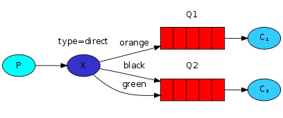

# RabbitMQ Tutorial - Routing

## Routing (using Steeltoe)

### Prerequisites

> This tutorial assumes RabbitMQ is [downloaded](https://www.rabbitmq.com/download.html) and installed and running
> on `localhost` on the [standard port](https://www.rabbitmq.com/networking.html#ports) (`5672`).
>
> In case you use a different host, port or credentials, connections settings would require adjusting.

In the [previous tutorial](../Tutorial3/readme.md) we built a
simple fanout exchange. We were able to broadcast messages to many
receivers.

In this tutorial we're going to add a feature to it - we're going to
make it possible to subscribe only to a subset of the messages. For
example, we will be able to direct only  messages to the
certain colors of interest ("orange", "black", "green"), while still being
able to print all of the messages on the console.

Bindings
--------

In previous examples we were already creating bindings. You may recall
code like this:

```csharp
[DeclareQueueBinding(Name = "tut.fanout.binding.queue1", ExchangeName = "tut.fanout", QueueName = "#{@queue1}")]
```

Remember, a binding is a relationship between an exchange and a queue. This can
be simply read as: the queue is interested in messages from this
exchange.

Bindings can take an extra routing key parameter which we didn't use in the previous tutorial.  
We can specify the key using the `RoutingKey` property on the `DeclareQueueBinding` attribute as shown below:

```csharp
[DeclareQueueBinding(Name = "tut.direct.binding.queue1.orange", ExchangeName = "tut.direct", RoutingKey = "orange", QueueName = "#{@queue1}")]
```

The meaning of a routing key depends on the exchange type. The
`fanout` exchanges, which we used previously, simply ignored its
value.

Direct exchange
---------------

Our messaging system from the previous tutorial broadcasts all messages
to all consumers. We want to extend that to allow filtering messages
based on their color type. For example, we may want a program which
writes log messages to the disk to only receive critical errors, and
not waste disk space on warning or info log messages.

Before, we were using a `fanout` exchange, which doesn't give us much
flexibility - it's only capable of mindless broadcasting.

In this tutorial We will use a `direct` exchange instead. The routing algorithm behind
a `direct` exchange is simple - a message goes to the queues whose
binding key exactly matches the routing key of the message.

To illustrate that, consider the following setup:

<div class="diagram">
  
</div>

In this setup, we can see the `direct` exchange `X` with two queues bound
to it. The first queue is bound with binding key `orange`, and the second
has two bindings, one with binding key `black` and the other one
with `green`.

In such a setup a message published to the exchange with a routing key
`orange` will be routed to queue `Q1`. Messages with a routing key of `black`
or `green` will go to `Q2`. All other messages will be discarded.

Multiple bindings
-----------------

<div class="diagram">
  
</div>

It is perfectly legal to bind multiple queues with the same binding
key. In our example we could add a binding between `X` and `Q1` with
binding key `black`. In that case, the `direct` exchange will behave
like `fanout` and will broadcast the message to all the matching
queues. A message with routing key `black` will be delivered to both
`Q1` and `Q2`.

Here are the `DeclareQueueBinding` attributes that illustrate the above concepts.

```csharp
[DeclareQueueBinding(Name = "tut.direct.binding.queue1.orange", ExchangeName = "tut.direct", RoutingKey = "orange", QueueName = "#{@queue1}")]
[DeclareQueueBinding(Name = "tut.direct.binding.queue1.black", ExchangeName = "tut.direct", RoutingKey = "black", QueueName = "#{@queue1}")]
[DeclareQueueBinding(Name = "tut.direct.binding.queue2.green", ExchangeName = "tut.direct", RoutingKey = "green", QueueName = "#{@queue2}")]
[DeclareQueueBinding(Name = "tut.direct.binding.queue2.black", ExchangeName = "tut.direct", RoutingKey = "black", QueueName = "#{@queue2}")]

```

Publishing messages
-------------

We'll use this model for our routing system. Instead of `fanout` we'll
send messages to a `direct` exchange defined using the attribute shown below:

```csharp
[DeclareExchange(Name = "tut.direct", Type = ExchangeType.DIRECT)]
```

We will supply the color as a routing key in the `ConvertAndSendAsync()` method call. That way the receiving program will be able to select
the color it wants to receive (or subscribe to).

Subscribing
-----------

Receiving messages will work just like in the previous tutorial, with
one exception - we're going to create a new binding for each color
we're interested in.

Here's what that looks like in the `Tut4Receiver`:

```csharp
using Microsoft.Extensions.Logging;
using Steeltoe.Messaging.RabbitMQ.Attributes;
using Steeltoe.Messaging.RabbitMQ.Config;
using System.Diagnostics;

namespace Receiver
{
    [DeclareExchange(Name = "tut.direct", Type = ExchangeType.DIRECT)]
    [DeclareAnonymousQueue("queue1")]
    [DeclareAnonymousQueue("queue2")]
    [DeclareQueueBinding(Name = "tut.direct.binding.queue1.orange", ExchangeName = "tut.direct", RoutingKey = "orange", QueueName = "#{@queue1}")]
    [DeclareQueueBinding(Name = "tut.direct.binding.queue1.black", ExchangeName = "tut.direct", RoutingKey = "black", QueueName = "#{@queue1}")]
    [DeclareQueueBinding(Name = "tut.direct.binding.queue2.green", ExchangeName = "tut.direct", RoutingKey = "green", QueueName = "#{@queue2}")]
    [DeclareQueueBinding(Name = "tut.direct.binding.queue2.black", ExchangeName = "tut.direct", RoutingKey = "black", QueueName = "#{@queue2}")]
    internal class Tut4Receiver
    {
        private readonly ILogger _logger;

        public Tut4Receiver(ILogger<Tut4Receiver> logger)
        {
            _logger = logger;
        }
  ....
 }
}
```

Putting it all together
-----------------------

<div class="diagram">
  
</div>

The code for our sender class (`Tut4Sender`) is:

```csharp
using Steeltoe.Messaging.RabbitMQ.Core;
using System.Text;

namespace Sender
{
    public class Tut4Sender : BackgroundService
    {
        internal const string DirectExchangeName = "tut.direct";

        private readonly ILogger<Tut4Sender> _logger;
        private readonly RabbitTemplate _rabbitTemplate;

        private int index = 0;
        private int count = 0;

        private readonly string[] keys = new string[] { "orange", "black", "green" };

        public Tut4Sender(ILogger<Tut4Sender> logger, RabbitTemplate rabbitTemplate)
        {
            _logger = logger;
            _rabbitTemplate = rabbitTemplate;
        }


        protected override async Task ExecuteAsync(CancellationToken stoppingToken)
        {
            while (!stoppingToken.IsCancellationRequested)
            {
                _logger.LogInformation("Worker running at: {time}", DateTimeOffset.Now);
                StringBuilder builder = new StringBuilder("Hello to ");
                if (++index == 3)
                {
                    index = 0;
                }
                string key = keys[index];
                builder.Append(key).Append(' ');
                builder.Append(++count);
                var message = builder.ToString();

                await _rabbitTemplate.ConvertAndSendAsync(DirectExchangeName, key, message);
                _logger.LogInformation($"Sent '" + message + "'");
                await Task.Delay(1000, stoppingToken);
            }
        }
    }
}
```

The code for receiver class (`Tut4Receiver`) is:

```csharp
using Microsoft.Extensions.Logging;
using Steeltoe.Messaging.RabbitMQ.Attributes;
using Steeltoe.Messaging.RabbitMQ.Config;
using System.Diagnostics;

namespace Receiver
{
    [DeclareExchange(Name = "tut.direct", Type = ExchangeType.DIRECT)]
    [DeclareAnonymousQueue("queue1")]
    [DeclareAnonymousQueue("queue2")]
    [DeclareQueueBinding(Name = "tut.direct.binding.queue1.orange", ExchangeName = "tut.direct", RoutingKey = "orange", QueueName = "#{@queue1}")]
    [DeclareQueueBinding(Name = "tut.direct.binding.queue1.black", ExchangeName = "tut.direct", RoutingKey = "black", QueueName = "#{@queue1}")]
    [DeclareQueueBinding(Name = "tut.direct.binding.queue2.green", ExchangeName = "tut.direct", RoutingKey = "green", QueueName = "#{@queue2}")]
    [DeclareQueueBinding(Name = "tut.direct.binding.queue2.black", ExchangeName = "tut.direct", RoutingKey = "black", QueueName = "#{@queue2}")]
    internal class Tut4Receiver
    {
        private readonly ILogger _logger;

        public Tut4Receiver(ILogger<Tut4Receiver> logger)
        {
            _logger = logger;
        }


        [RabbitListener(Queue = "#{@queue1}")]
        public void Receive1(string input)
        {
            Receive(input, 1);
        }

        [RabbitListener(Queue = "#{@queue2}")]
        public void Receive2(string input)
        {
            Receive(input, 2);
        }

        private void Receive(string input, int receiver)
        {
            var watch = new Stopwatch();
            watch.Start();

            DoWork(input);

            watch.Stop();

            var time = watch.Elapsed;
            _logger.LogInformation($"Received: {input} from queue: {receiver}, took: {time}");
        }

        private void DoWork(string input)
        {
            foreach (var ch in input)
            {
                if (ch == '.')
                    Thread.Sleep(1000);
            }
        }
    }
}
```

Compile as usual, see [tutorial one](../Tutorial1/Readme.md)

```bash
cd tutorials\tutorial4
dotnet build
```

To run the receiver, execute the following commands:

```bash
# receiver

cd receiver
dotnet run
```

Open another shell to run the sender:

```bash
# sender

cd sender
dotnet run
```

Move on to [tutorial 5](../Tutorial5/readme.md) to find out how to listen
for messages based on a pattern.
